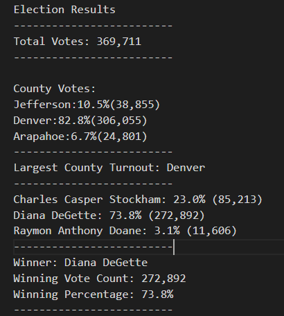

### Election Analysis
The purpose of this analysis was to deliver the congressional election results from a precinct in Colorado that spans three counties (Jefferson, Denver, Arapahoe). The analysis allows us to break down the election results by candidate and county, providing insights into which counties have high voter turn-outs, and how each candidate fared in an easy to understand deliverable. Furthermore, due to the dynamic nature of this script, it provides a framework for the Colorado Board of Elections to analyze any other elections they so choose. 

## Election-Audit Results:
- There were a total of 369,711 votes cast in this election.

- Jefferson County: 38,855 votes (10.5% of total votes)
  Denver County: 306,055 votes (82.8% of total votes)
  Arapahoe County: 24,801 votes (6.7% of total votes)
  
- Denver County had the largest number of votes by a large margin.

- Charles Casper Stockham: 85,213 votes (23.0% of total votes)
  Diana DeGette: 272,892 votes (73.8% of total votes)
  Raymon Anthony Doane: 11,606 (3.1% of total votes)
  
- Election winner: Diana DeGette (272,892 votes, 73.8% of total votes)

# Election-Audit Summary:
Due to the dynamic nature of this script, it could be used to analyze any state or national election. As long as the dataset contains a ballot ID, county, and the name of the candidate voted for, this script would work to analyze any state election, even if there were a different number of counties/candidates participating in the election. To analyze a national election, one would only need to replace the county names with states (and change variable names), and the analysis would run the same. By not directly tying the code to our current dataset, it is possible to use this script to analyze any election given a Ballot ID, County (or state), and the candidate who was voted for. 
